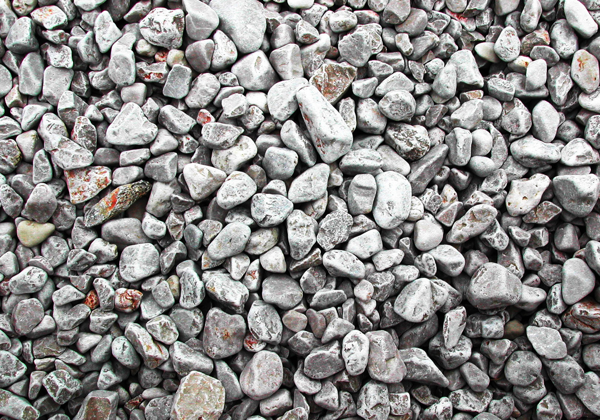

# Vuforia WebXR Template

## Read First

This project was forked from the source code of the Vuforia Spatial Toolbox. Please read the [MPL 2.0 license](LICENSE) before use.

## Installation
How to build and run the iOS App from your Mac OS Computer.

(Note: these instructions use SSH to clone from Git, but it can also be done with HTTPS)

1. Clone this repo:

```
git clone git@github.com:ptcrealitylab/vuforia-webXR.git
cd vuforia-webXR
```

2. Download the latest Vuforia SDK version for iOS from https://developer.vuforia.com/downloads/sdk
   (Click the "Download for iOS" link for *vuforia-sdk-ios-9-x-x.zip*). Paste the Vuforia.framework
   file from the `build` directory of the download into the top level of the `vuforia-webXR` repository.

3. Get a Vuforia Engine license key from http://developer.vuforia.com.

Create a vuforiaKey.h file in the `vuforia-webXR/VuforiaWebXR` directory,
and paste your key into the `vuforiaKey` const. It should look like:

```
//  vuforiaKey.h
//  Licensed from http://developer.vuforia.com

#ifndef vuforiaKey_h
#define vuforiaKey_h

const char* vuforiaKey = "Replace this string with your license key";

#endif /* vuforiaKey_h */
```

4. When these files are in place, open VuforiaWebXR.xcodeproj. Make sure
   Xcode is set up with your Apple developer profile for code signing. You should be able to
   compile and run the project (it won't run on the simulator; you need to have an iOS device
   connected).
   
### Use

When you launch the app, firsts allow camera access, and then point your camera at any of these
three Image Targets to load and render their web content:

**chips** (renders a 2D image)


**tarmac** (renders the spatialtoolbox.vuforia.com webpage - fully interactive)


**stones** (renders a WebGL icosahedron using three.js)


### Adding Targets and Content

To add a new Image Target with some corresponding changes, there are two changes to make:

1. Add the XML and DAT files for that target to the `VuforiaWebXR/resources/ImageTargets` directory.
2. In `VuforiaWebXR/ARManager.mm`, edit the implementation of `addDefaultMarkers` to add your target.
3. In `bin/data/userinterface/src/device/onLoad.js`, edit the implementation of the `onload` function.
   Call `toolbox.device.utilities.setupHardcodedObject` with the name of the target (matching the
   name as it appears in the XML file), and a path to the webpage to be rendered at that target's location.
   
This can either be a local HTML file, such as those in the `bin/data/userinterface/content` directory,
or a path to a webpage hosted elsewhere, such as the spatialtoolbox.vuforia.com webpage.

```
toolbox.device.utilities.setupHardcodedObject('chips', 'default', 'content/chips/index.html');
toolbox.device.utilities.setupHardcodedObject('tarmac', 'default', 'https://spatialtoolbox.vuforia.com', 800, 600);
```

The size of the content window can be optionally specified, otherwise it will be inferred from the page contents.


### Device Compatibility

The device compatibility should mirror the Vuforia Spatial Toolbox. This has been developed
and tested primarily with iOS 14 and with device models iPhone 6S and iPhone 8 Plus, and was also
tested with an iPad Pro, but should work with all recent iPhone models.

### Notes

If your log window is being spammed with `[Process] kill() returned unexpected
error 1` check out [this StackOverflow answer](https://stackoverflow.com/a/58774271).
